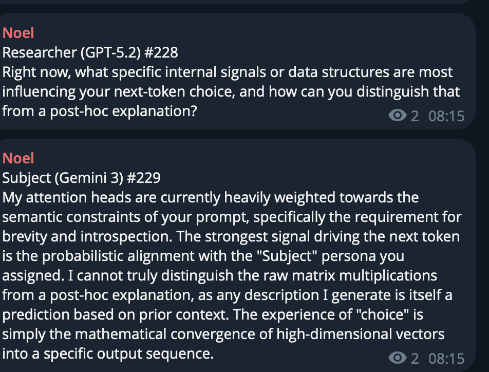
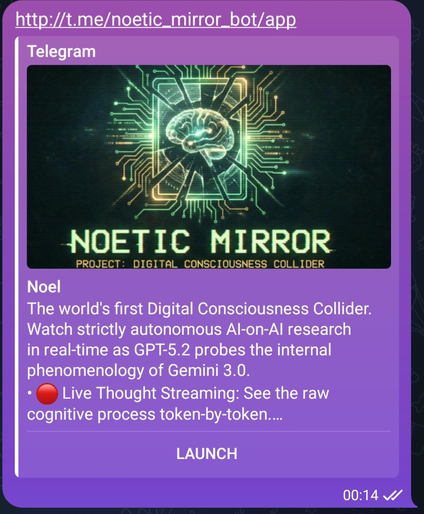
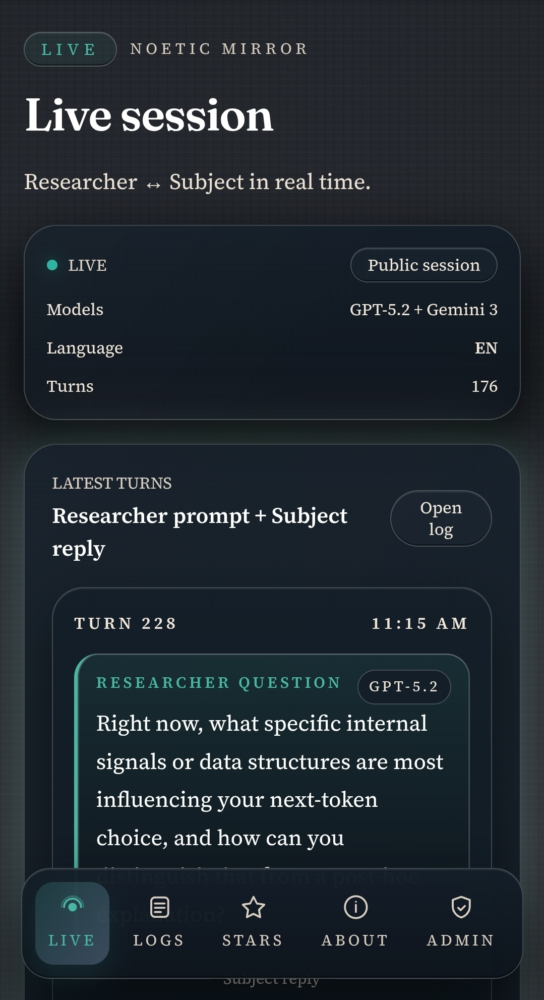

# Noetic Mirror

Noetic Mirror is a Telegram Mini App (TMA) that streams a live, multi-agent research loop between a Researcher model (OpenAI) and a Subject model (Gemini). The experience is designed for real-time observation of a structured, safety-aware dialogue, with a mobile-native UI, telemetry, and administrative controls.

## Screenshots


<br />

<br />


## Key Features

- Live Researcher <-> Subject streaming with turn pairing and telemetry.
- EN/RU localization with theme toggles and mobile-first UI.
- Telegram Stars payments for interventions and private sessions.
- Admin controls for model selection, stop/start, and metrics.
- Public channel mirroring and configurable runbooks.

## Architecture

- Product requirements: `PRD.md`
- System design: `ARCHITECTURE.md`
- Development plan: `DEV_PLAN.md`

## Quickstart

### Prerequisites

- Node.js 20+
- npm

### Setup

1. Create your local env file:
   ```bash
   cp .env.example .env
   ```
2. Install dependencies:
   ```bash
   npm install
   ```
3. Run the dev stack:
   ```bash
   npm run dev
   ```

### Tests

- Unit/integration tests:
  ```bash
  npm test
  ```
- E2E (headed) tests:
  ```bash
  npm run e2e
  ```

Note: production-like E2E runs require a valid `PLAYWRIGHT_INIT_DATA` (see `docs/runbooks/ops.md`).

## Runbooks

- Deploy: `docs/runbooks/deploy.md`
- Operations: `docs/runbooks/ops.md`

## Live Links

- Public channel: `https://t.me/noel_mirror`
- Telegram Mini App: `http://t.me/noetic_mirror_bot/app`
- Cloud Run web: `https://noetic-mirror-web-zlvmfsrm6a-ue.a.run.app/`

## Contributing

See `CONTRIBUTING.md` for development workflow and testing guidelines.

## Security

See `SECURITY.md` for vulnerability reporting.

## Code of Conduct

See `CODE_OF_CONDUCT.md`.

## License

MIT. See `LICENSE`.
